# System Flow Diagram

This document contains visual flow diagrams of the zero-knowledge identity verification system.

## Complete System Flow

```mermaid
flowchart TD
    Start([User Starts Verification Process])
    
    subgraph Issuers["🏛️ Identity Issuers"]
        IssuerA[Issuer A: DMV<br/>Issues DOB Credential]
        IssuerB[Issuer B: Immigration<br/>Issues Citizenship Credential]
    end
    
    subgraph UserProcess["👤 User Process"]
        ConnectWallet[Connect Wallet<br/>MetaMask]
        RequestCreds[User Requests Credentials<br/>with DOB/Citizenship Input]
        ReceiveDOB[Receive DOB Credential<br/>Signed by Issuer A<br/>Bound to Wallet]
        ReceiveCit[Receive Citizenship Credential<br/>Signed by Issuer B<br/>Bound to Wallet]
        GenerateProof[Generate Zero-Knowledge Proof<br/>Using Circom Circuit<br/>with Wallet Binding]
    end
    
    subgraph Circuit["🔐 Zero-Knowledge Circuit"]
        VerifySigA[Verify Issuer A<br/>ECDSA Signature]
        VerifySigB[Verify Issuer B<br/>ECDSA Signature]
        CheckAge[Check Age >= 18]
        CheckCit[Check Citizenship == US]
        VerifyUser[Verify Same User<br/>Public Key]
        VerifyWallet[Verify Wallet Binding<br/>user_pubkey == subject_wallet]
        CreateProof[Create Groth16 Proof<br/>with 9 Public Signals]
    end
    
    subgraph OnChain["⛓️ On-Chain Verification"]
        SubmitProof[Submit Proof to<br/>Smart Contract]
        VerifyWallet[Verify Wallet Match<br/>msg.sender == subject_wallet]
        VerifyProof[Verifier Contract<br/>Verifies zk-Proof]
        CheckIssuers[Check Issuer Keys<br/>in Registry]
        UpdateStatus[Update Verification<br/>Status]
        Success[✅ User Verified]
    end
    
    Start --> ConnectWallet
    ConnectWallet --> RequestCreds
    RequestCreds --> IssuerA
    RequestCreds --> IssuerB
    IssuerA --> ReceiveDOB
    IssuerB --> ReceiveCit
    ReceiveDOB --> GenerateProof
    ReceiveCit --> GenerateProof
    
    GenerateProof --> VerifySigA
    GenerateProof --> VerifySigB
    VerifySigA --> CheckAge
    VerifySigB --> CheckCit
    CheckAge --> VerifyUser
    CheckCit --> VerifyUser
    VerifyUser --> VerifyWallet
    VerifyWallet --> CreateProof
    
    CreateProof --> SubmitProof
    SubmitProof --> VerifyWallet
    VerifyWallet --> VerifyProof
    VerifyProof --> CheckIssuers
    CheckIssuers --> UpdateStatus
    UpdateStatus --> Success
    
    style Start fill:#e1f5ff
    style Success fill:#d1fae5
    style IssuerA fill:#fef3c7
    style IssuerB fill:#fef3c7
    style Circuit fill:#ddd6fe
    style OnChain fill:#dbeafe
```

## Detailed Proof Generation Flow

## Data Flow Diagram

## Component Interaction Diagram

## Security Flow

